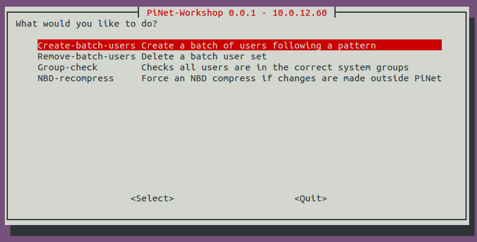

# PiNet-Workshop
An experimental tool for PiNet servers for Raspberry Pi workshop organisers. Its functionality it currently very limited but am taking suggestions for new features.   




##How to use
1. Download pinet-workshop with ```wget https://raw.githubusercontent.com/PiNet/PiNet-Workshop/master/pinet-workshop```.
2. Run pinet-workshop using ```sudo bash pinet-workshop```.

**Warning - The software is experimental and thrown together for a few workshops I was running. It has very little input validation or error detection so be very careful what data you input! **   
